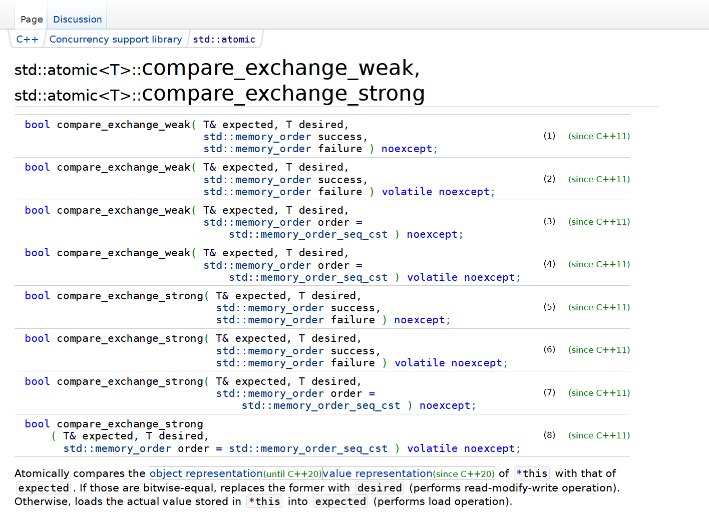

# C++11线程库

## std::atomic

> 轻量的保证原子性的类型

包括不仅限于下面的类型的原子操作：

### 如何保证的原子操作

为什么会有原子性的问题, 对于底层汇编而言, 传统的++, --操作会编译成为多条汇编指令, 将值提取出来, 进行操作, 再store回去, 操作到store的过程中如果重入, 就会导致数据不一致, 我们通过CAS保证store的时候的值和load时候的值一致, 这样就保证了原子性。

CAS指令, 将几个指令合并成一个指令就行原子操作。

CAS指令的原理是，当且仅当内存中的值等于预期值时，才将新值写入内存, 比如说`a = 1`, 进行a++, 我们在就行++写入的时候保证+1后将值写入的时候，这个时候a还是等于原来的a, 不能被另一个执行流修改

### weak和strong的区别

weak可能存在虚假的失败, 由于编译器优化的问题, 就算是成功的CAS操作, 也可能失败, 所以weak的CAS操作不适合用于循环操作。

> cpu中存在缓存, compare_and_swap会将寄存器中的值和内存中的值进行比较, 但是访问内存的时候, 可能发现缓存中存在这个值, 这个时候我们直接将缓存取出进行比较, 但是缓存可能是之前的数据, 这个时候就会出现问题, 所以会导致compare_and_swap失败, 所以weak的CAS操作不适合用于循环操作。

strong不会出现虚假的失败, 但是会有性能损失, 所以strong的CAS操作适合用于循环操作。

> 由于strong的CAS操作会将内存中的值和寄存器中的值进行比较, 所以会有性能损失, 所以strong的CAS操作适合用于循环操作。