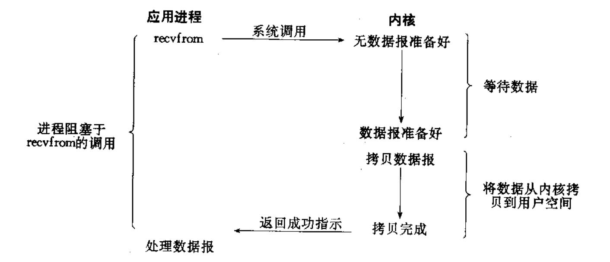
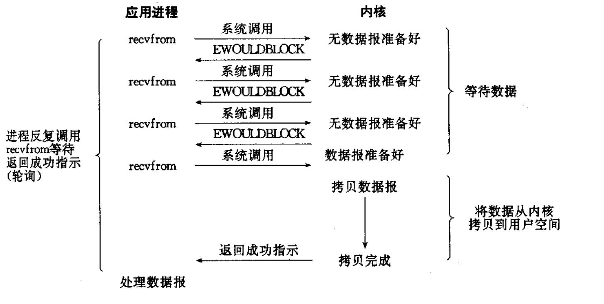
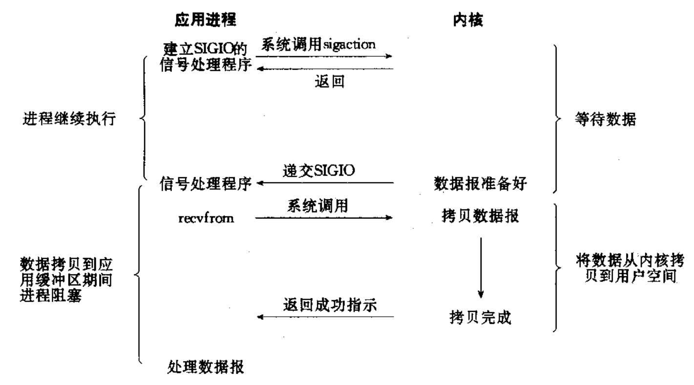
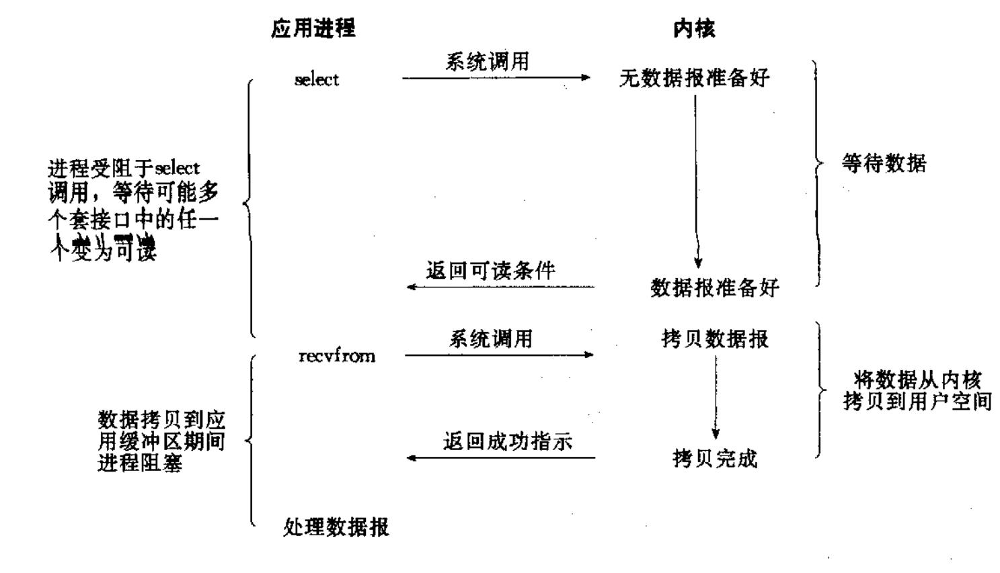
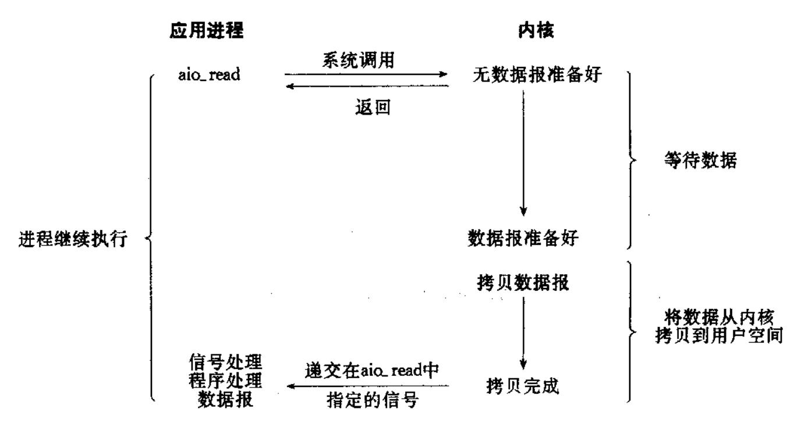
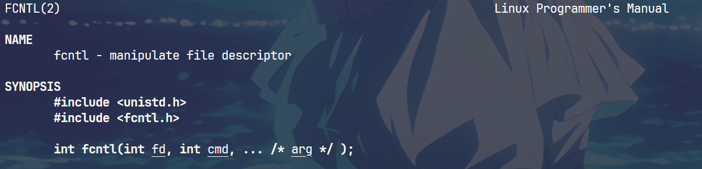

# IO复用(多路转接)

## 五种IO模型


* **阻塞IO**: 在内核将数据准备好之前, 系统调用会一直等待.  所有的套接字, 默认都是阻塞方式.
    

* **非阻塞IO**: 非阻塞 IO: 如果内核还未将数据准备好, 系统调用仍然会直接返回, 并且返回EWOULDBLOCK 错误码.

    

* **信号驱动IO**: 内核将数据准备好的时候, 使用 SIGIO 信号通知应用程序进行 IO操作
    

* **多路转接**:: 虽然从流程图上看起来和阻塞 IO 类似. 实际上最核心在于 IO 多路转接能够同时等待多个文件描述符的就绪状态.

    

* **异步 IO**: 由内核在数据拷贝完成时, 通知应用程序(而信号驱动是告诉应用程序何时可以开始拷贝数据).
    

**总结**

> IO的核心都是`等待 + IO`, 日常中等待的时间远大于IO, 所以如何处理等待的时间就是我们处理IO需要考虑的问题。

## 如何将文件描述符设置成为非阻塞

由于`Linux`下一切皆文件, 所以我们这里考虑的是文件 + 特殊文件 + 套接字等等,由于对于文件描述符来说, 在`Linux`操作系统中通过`struct file`维护文件的基本的信息。默认情况下, 所有的文件都是设置成阻塞的。

**文件属性操作的函数调用**



```c
// 当然也可以设置成为宏
void setNoBlock(int fd)
{
    // 获取文件当前状态
    int fl = ::fcntl(fd,F_GETFL);
    if(fl < 0)
    {
        perror("fcntl获取失败");
        return;
    }
    // 在原来的基础上将文件属性加上NO_BLOCK
    fcntl(fd,F_SETFL, fl | O_NONBLOCK); 

}
```

## **多路转接**

本文主要还是讨论,如何使用多路转接的方式。那么我们如何更加直观的理解多路转接的思想呢？

**场景**:
> 如果我们使用TCP建立Web服务, 当我们的多个用户来到后, 会产生很多的通信套接字, 这个时候如果我们是`同步处理`的服务，我们有很多种思路:
> 1. 多线程 : 每个线程维护一个通信套接字，当通信结束后, 线程被线程池回收。但是缺点也很明显, 通信套接字通过三次握手建立成功后, 不一定获取，可能导致出现大量的不活跃的连接，这个时候，就会显著的浪费线程的资源。 
> 2. IO复用 : Linux内核帮助实现了IO复用模型,包括`poll epoll select`，实现方式不同，但是思路都一样，帮助我们管理`一群非阻塞文件描述符`, 类似于养鱼，当我们的操作系统或不断地遍历判断每个文件描述符的状态，就和我们的养鱼人会不断检查鱼的情况，当某个文件描述符读写就绪后，也就是鱼长大了，就会通知用户层，可以处理了。

上面我们是通俗的介绍了多路复用的原理，但是`Linux`实现多路复用的接口也有三种`select poll epoll`

### select


```c
 #include <sys/select.h>

int select(int nfds, fd_set *readfds, fd_set *writefds,
            fd_set *exceptfds, struct timeval *timeout);

void FD_CLR(int fd, fd_set *set);
int  FD_ISSET(int fd, fd_set *set);
void FD_SET(int fd, fd_set *set);
void FD_ZERO(fd_set *set);
```

- nfds : 是需要管理的文件描述符的个数 + 1

- rdset,wrset,exset 分别对应于需要检测的可读文件描述符的集合，可写文件描述符的集 合及异常文件描述符的集合;

- timeout : 表示select的等待时间

> fd_set是位图的类型, 类似于C++里面的std::bitmap, 通过一个bit表示文件描述组的状态。 后面的四个函数都是帮助我们操作fd_set这种类型。

**缺点明显**:

- 每次调用 select, 都需要手动设置 fd 集合, 从接口使用角度来说也非常不便. • 每次调用 select，都需要把 fd 集合从用户态拷贝到内核态，这个开销在 fd 很多时会很大

- 同时每次调用 select 都需要在内核遍历传递进来的所有 fd，这个开销在 fd多时也很大

- select 支持的文件描述符数量太小.


### poll

```c
struct pollfd {
    int   fd;         /* file descriptor */
    short events;     /* requested events */
    short revents;    /* returned events */
};

int poll(struct pollfd *fds, nfds_t nfds, int timeout);
```

>  不同于 select 使用三个位图来表示三个 fdset 的方式，poll 使用一个 pollfd 的指针实现. 

pollfd 结构包含了要监视的 event 和发生的 event，不再使用 select“参数-值”传
递的方式. 接口使用比 select 更方便. • poll 并没有最大数量限制 (但是数量过大后性能也是会下降)

#### **poll 的缺点** :

poll 中监听的文件描述符数目增多时和select函数一样poll 返回后，需要轮询 pollfd 来获取就绪的描述符. • 每次调用 poll 都需要把大量的 pollfd 结构从用户态拷贝到内核中. 同时连接的大量客户端在一时刻可能只有很少的处于就绪状态, 因此随着监视
的描述符数量的增长, 其效率也会线性下降.

### epoll

