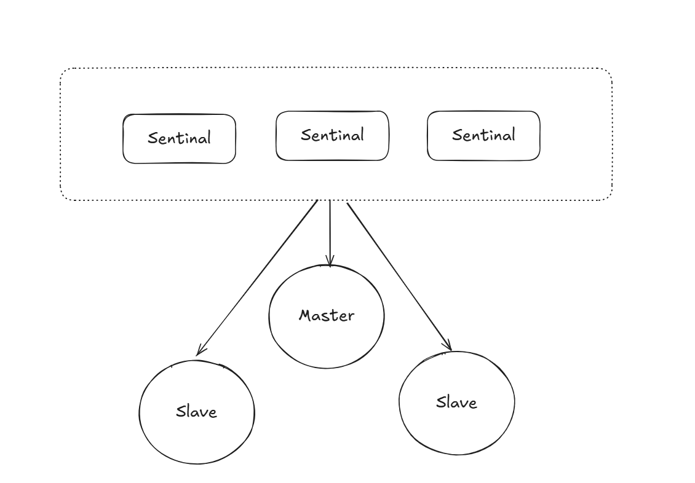

# Redis进阶

## 持久性

Redis是内存级别的数据库, 其实是不持久的, 为了让Redis持久化, 只有将数据存储在硬盘里面, 但是Redis相比于MySql, 他的速度快很多,
为了保证速度快, 怎么进行平衡这些关系, 最终Redis决定既存储在内存, 又存储在硬盘, 实际上也可能存在差异。

Redis写入硬盘的时候也会进行性能的优化, 让他区别于MySQL, 有着很大的性能优势。

### Redis快照

- 手动触发

    - save : 由于Redis是单线程, 可能阻塞Redis的其他客户端

    - bgsave : backgroud save, 不会影响Redis服务器处理其他的请求, 这里的实现方式不是多线程, 此处Redis使用的"多进程"的方式实现的并发编程, 但是由于Windows上面进程开销很大

- 自动触发

    配置在配置脚本中, 定期多久进行触发

通过rdb进行压缩, 生成一个rdb的成本是很高的, 不能太过频繁的进行rdb拷贝的这个操作


## AOF

append only file通过记录Redis的操作进行持久化

**会影响Redis的性能吗**

不会, 他并不会怎么影响Redis的性能, AOF并不是通过工作线程写入硬盘, 而是写入内存级缓冲区, 等到特定的时候进行写入硬盘

**如果缓冲区中的数据没来得及写入, 进程就挂掉了, 会出现数据都是吗**

会, Redis的速度很快, 所以鱼与熊掌不可兼得

Redis提供了一些选项

- always : 频率最高

- everysec : 每秒

- no : 通过os控制fsync控制频率

Redis存在整理aof的机制, 能够整理合并删除一些冗余的操作。

内存中的文件结果, 已经是文件整理后的结果了, 区别与rdb就是二进制和文本文件的差别

**aof对于fork后的新的数据**, redis通过aof_rewrite_buf进行fork后续的时间段进行数据的写入, 这是区别于rdb的关键点, 这也是为什么rdb是定时备份, aof是实时备份。

**为什么aof_rewrite_buf**还要保证写到旧的aof里面, 因为如果新的数据出现问题, 我们还是需要保证旧的aof文件。


### 混合持久化

aof本来通过文本进行写入文件, Redis后续就引入了混合持久化, 结合rdb和aof的特点, Redis将操作/请求通过rdb的格式写入到aof文件中, 后续rewrite中进行的操作, 通过aof文本格式进行追加

如果aof和rdb同时启动, 我们的Redis以什么为主呢？以aof为主, 这个时候rdb就会直接被忽略。

## Redis的事务

- 原子性 : 将多个命令进行打包

- 一致性 : redis没有约束, 没有回滚的机制, 可能引起数据的一致性

- 持久化 : 不具备持久性, 内存级数据库, rdb和aof只是锦上添花

- 隔离性 : 单线程模型, 没有隔离性的问题

### Redis和MySQL的区别

- Redis不像MySQL那样会针对出现问题的事务进行回滚。

### Redis实现事务

Redis开启事务, 客户端输入的命令, 就会存储在服务器中的任务队列中, Redis会将队列中的事务处理结束, 才会处理其他客户端的请求/操作

### Redis事务相关的命令


- 开启事务 : multi, 存放进入服务器的事务队列, 类似SQL中的start transaction

- 执行命令 : exec , 类似SQL中的commit

- 取消事务: discard, 类似rollback

- watch: 可以观察外部修改, 帮助我们感知外部的变化

    watch的实现方式, 类似于乐观锁和悲观锁, 根据锁冲突的预期概率进行的预期。当一个客户端watch key, 当我们的一个客户端执行watch的时候, 这个时候会生成版本号, 其他客户端修改这个key的时候, 会使的版本号进行增长, 
    所以我们的watch客户端就能够该知道key的变化, 这种锁的机制不同于std::mutex里面的悲观锁, 他的核心是我们的操作失败, 而不是加锁阻塞

## Redis的主从复制

从节点需要同步主节点, 从节点只有查看数据的权限

### 构建Redis服务集群

```bash
redis-server path/Config_Name.conf
```
slaveof选项, 构成主从结构

- 配置文件假如slaveof{masterHost}{masterPort}

- 启动时 --slaveof {masterHost}{masterPort}

- redis命令 slaveof{mastarHost}{masterPort}


info replication查看详细信息

### **删除主从结构**

slaveof no one

### **TCP内部支持nagle算法**

- 开启增加传输延迟, 节省了网络的带宽

- 关闭相反

他的本质就是捎带应答, 将多个小的的数据包进行了合并, 默认是开启的, rep-disable-tcp-nodelay,如果对于是游戏这种应用场景, 一般为了会关闭这个算法。

### 拓扑结构

如果写数据请求太多，我们可以将主节点的aof关闭，提高主节点处理任务的能力
bug就是需要主节点重新启动的时候，从从节点拉取aof文件

### 过程

slaveof ip port

- 保存主节点的信息

- 主从建立连接 (TCP三次握手) : 是否有路

- ping : 验证是否能够正常工作 : 路是否能够通行

- 权限认证 : 发送密码是否匹配

- 同步数据集

- 命令持续复制

### psync

从节点执行psync, 从节点从主节点拉取数据, 能够默认执行

- replicationid : 主节点生成的复制id, 每次重启生成的rep_id都是不同的, 从节点可以从主节点获取到这个rep_id, info replication尅获取到这个值 


### offset

偏移量, 主节点和从节点都会维护一个偏移量, 主节点的偏移量维护的是命令的字节数目,

### 如何进行数据的同步

从节点和主节点之间进行数据同步通过传输rdb文件进行同步, 主节点会在子进程写rdb文件的时候会创建临时缓冲区进行这段时间的写入操作, 后续写入rdb发送给slave

**无硬盘模式** : 

主节点生成rdb文件, 不保存进入文件中, 直接进行网络传输, (省下了一段读写硬盘的操作)

从节点收到rdb数据, 直接将rdb文件进行加载, 省略了写入硬盘的操作

### rep-id和run-id

一个Redis服务器同时存在rep-id和run-id, 通过`info server`可以看到run-id, rep-id和run-id的长度和结构相同。

- rep-id: 主从节点拥有相同的rep-id, rep-id和offset表示一个数据集

- run-id: 每次运行都不同, 他的作用是标识一次Redis Server的运行, 他的作用主要是支撑哨兵的机制

### 数据同步的方式

- 全量复制 : 从节点刚刚连上主节点, 进行的数据初始化工作(rdb)

- 部分复制 : 全量复制的优化手段(比如说从节点和主节点的连接断开, 重新连接的时候)

- 实时复制 : 从节点需要和主节点之间的数据信息保持实时一致

    通过主节点和从节点的TCP长连接进行请求/操作的同步

### 引入Redis的哨兵机制

主节点挂了, 从节点不会主动的晋升成为主节点, 只有当我们的从节点主动断开的时候, slave节点才能晋升成为主节点, 因此, 这里就需要我们的哨兵机制来进行解决。

## Redis哨兵

### 简单理解哨兵机制

Redis提供了一种单独的进程`redis-sentinal`, 表示哨兵的进程, 针对的我们的Redis节点(Redis Server)进行监控的功能, 通常情况下我们的哨兵节点也会多搞几个哨兵节点构成一个哨兵节点的集合, 防止一个哨兵节点因为挂了导致处理的问题。

哨兵节点集群通过TCP长连接发送心跳包对主节点和从节点进行监控, 通过多个哨兵节点可以判断主节点是否挂了, 

主节点如果确实挂了, 会从哨兵节点中推选出一个新的主节点

### 核心功能

- 监控

- 自动的故障转移

- 通知

### 注意事项

- 哨兵节点的个数过少 : 哨兵节点过少, 哨兵节点容易出现问题, 并且哨兵节点出现故障误判的几率也比较大

- 一般哨兵节点最少搞基数个 : 方便选举, 以为方便进行选举

### 通过docker搭建环境



> 由于条件艰苦, 这六个程序都被我部署在一个主机上, 实际上，这六个服务在一个主机上是没有用的。

**docker**

> 虚拟机就是通过软件模拟另外的一些硬件(构造一个新的电脑), 虚拟机可以很好做好软件的隔离, 类似于Windows的VMWare, 对电脑的配置要求很大
> docker完美解决了这个问题, 可以理解为他是一个轻量的虚拟机, 能够进行环境隔离的效果。

docker compose通过yml进行配置

### 哨兵节点存在的意义


1. 创建Redis集群, 主节点挂掉后, 从节点会自动选举出新的主节点

2. 实现读写分离, 主节点负责写, 从节点负责读, 避免单点故障

3. 实现哨兵节点的高可用, 哨兵节点可以监控Redis集群的状态, 并进行故障转移

4. 实现集群的高可用, 主节点和从节点可以自动切换, 避免单点故障

5. 实现集群的可扩展性, 可以动态的增加或减少Redis节点, 而不需要停机

### 哨兵节点的工作原理

哨兵节点集群通过TCP长连接发送心跳包对主节点和从节点进行监控, 通过多个哨兵节点可以判断主节点是否挂了, 主节点如果确实挂了, 会从哨兵节点中推选出一个新的主节点, 哨兵节点还可以通知客户端进行重连。 

哨兵节点的工作流程如下: 

1. 哨兵节点集群通过TCP长连接发送心跳包对主节点和从节点进行监控

2. 哨兵节点接收到主节点或从节点的心跳包, 记录节点的状态

3. 如果哨兵节点发现某个节点的状态异常, 则根据投票的结果进行主节点的选举, 并通知客户端进行重连

4. 哨兵节点可以配置多个哨兵节点, 实现高可用

### 哨兵节点的配置

哨兵节点的配置如下: 

```
sentinel monitor mymaster 192.168.1.1 6379 2
sentinel down-after-milliseconds mymaster 30000
sentinel failover-timeout mymaster 180000
sentinel parallel-syncs mymaster 1
```

- monitor mymaster 192.168.1.1 6379 2 : 表示监控的主节点的名称, 地址, 端口, 故障转移的投票数

- down-after-milliseconds mymaster 30000 : 表示主节点失效的时长, 单位是毫秒

- failover-timeout mymaster 180000 : 表示故障转移的超时时间, 单位是毫秒

- parallel-syncs mymaster 1 : 表示从节点同步主节点数据的并发数

### 哨兵节点的选举

哨兵节点通过投票机制进行主节点的选举, 选举的规则如下: 

1. 每个哨兵节点都向其他哨兵节点发送自己的投票信息

2. 如果超过半数的哨兵节点投票, 则认为主节点失效, 开始故障转移

3. 哨兵节点向其他哨兵节点发送故障转移的命令, 其他哨兵节点接收到命令后, 开始进行故障转移

4. 故障转移后, 哨兵节点会向客户端发送消息, 通知客户端进行重连

### 哨兵节点的故障转移

哨兵节点通过投票机制进行主节点的选举, 选举的规则如下: 

1. 每个哨兵节点都向其他哨兵节点发送自己的投票信息

2. 如果超过半数的哨兵节点投票, 则认为主节点失效, 开始故障转移

3. 哨兵节点向其他哨兵节点发送故障转移的命令, 其他哨兵节点接收到命令后, 开始进行故障转移

4. 故障转移后, 哨兵节点会向客户端发送消息, 通知客户端进行重连

### 哨兵节点的通知

哨兵节点通过发布订阅模式进行通知, 哨兵节点会向频道(channel)发送消息, 订阅这个频道的客户端会收到消息, 通知客户端进行重连。

### 哨兵节点的命令

- sentinel get-master-addr-by-name mymaster : 获取主节点的地址

- sentinel slaves mymaster : 获取从节点的信息

- sentinel sentinels mymaster : 获取哨兵节点的信息

- sentinel reset mymaster : 重置哨兵节点的状态

- sentinel failover mymaster : 强制进行故障转移

- sentinel ckquorum mymaster : 检查哨兵节点的半数以上是否投票

- sentinel flushconfig : 刷新哨兵节点的配置

- sentinel help : 查看哨兵节点的帮助信息

### 哨兵节点的监控

哨兵节点通过发布订阅模式进行监控, 哨兵节点会向频道(channel)发送消息, 订阅这个频道的客户端会收到消息, 进行主节点的状态监控。

### 哨兵节点的高可用

哨兵节点通过发布订阅模式进行高可用, 哨兵节点会向频道(channel)发送消息, 订阅这个频道的客户端会收到消息, 进行主节点的状态监控, 如果发现主节点失效, 则进行故障转移。

### 哨兵节点的架构

哨兵节点的架构如下: 


哨兵节点集群通过TCP长连接发送心跳包对主节点和从节点进行监控, 通过多个哨兵节点可以判断主节点是否挂了, 主节点如果确实挂了, 会从哨兵节点中推选出一个新的主节点, 哨兵节点还可以通知客户端进行重连。 

哨兵节点的工作流程如下: 

1. 哨兵节点集群通过TCP长连接发送心跳包对主节点和从节点进行监控

2. 哨兵节点接收到主节点或从节点的心跳包, 记录节点的状态

3. 如果哨兵节点发现某个节点的状态异常, 则根据投票的结果进行主节点的选举, 并通知客户端进行重连

4. 哨兵节点可以配置多个哨兵节点, 实现高可用


## Redis集群


## Redis实现分布式锁

