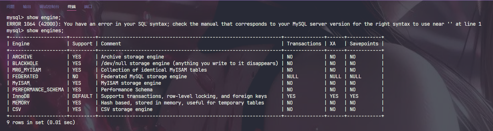

# MySQL事务

## 事务的本质

完成一个业务操作，需要多个SQL的操作，这样的操作集合称作事务，简单来讲就是一条或者多条SQL语句的集合。

**ACID**

- 原子性 : Atomicty

- 一致性 : 

- 隔离性 : 

- 持久性 : 

### 为什么存在事务？

事务是为了应用层进行服务的, 方便我们的上层代码针对多个操作进行组织, 他并不是天生存在于数据库的信息。


## 事务支持的引擎

MySQL中只有Innodb支持事务, Myisam不支持




## 设置隔离级别

```sql
set global transaction isolation level read uncommitted;
```


## 事务的基本操作


```sql
start transaction / begin

save point point_name # 做好标记

rowback to # 进行回滚

commit # 进行提交，提交后不能进行回滚
```
**进程被打断默认进行回滚**

### 是否启动默认提交的区别

set autocommit

设置自动提交为否的时候, 单SQL语句是一个事务，所以如果autocomment=false, 客户端崩掉，会直接回滚。


### 总结

- 设置begin/ commit, 事务需要我们手动commit, 确保持久化

- 对于Innodb, 每一条语句都是一条事务

- 如果 autocommit=false 且客户端在提交前崩溃，所有在该会话（Session/Connection）中执行的多条 SQL 语句所构成的一个未提交的事务，将会被 MySQL 服务器完全回滚（Rollback）

- 只有Innodb支持事务


