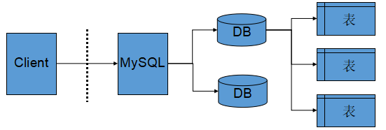

# MySQL初阶

## 登录mysql

> mysql -u root -p "后面跟你的passwd"

## MySQL数据库基础

### 重启服务

```shell
systemctl start mysqld
systemctl restart mysqld
``` 

### 登录选项

- -u : 用户选项(-u root就是以root用户登录)

- -h : ip地址(没有就是本机环回) 

- -P : 指明端口号

- -p : passwd(对应用户的密码)

### 什么是数据库

> MySQL是一个网络服务, 默认是3306
> mysqld是服务端, mysql是客户端
> mysql是一套给我们提供数据存取服务的网络程序

**数据库**

> 1. 在磁盘(MySQL)或者内存(Redis)中进行存储的特定结构组织的数据
> 2. 在磁盘上数据存储的解决方案

### 如何查看数据库

> show databases;


### 服务器，数据库，表之间的关系

> mysqld只负责管理和协助组织DataBase



## SQL分类

- DDL：数据定义语言，维护数据的类型，如create drop alter

- DML: 数据操作语言,对数据进行操作，如insert delete update

- DCL: 数据库控语言，负责权限管理和事务，如grant revoke commit

## 库的操作

### 库的默认的路径

/var/lib/mysql

### 创建数据库

CREATE DATABASE [IF NOT EXISTS] db_name [create_specification [,create_specification]]

### 删除数据库

DROP DATABASE db_name

### 数据库的编码集

1. 数据库编码集和

2. 数据库校验集合

数据库无论对数据进行任何操作, 都应该保证对数据库的操作盒编码是一致的。

### 查看字符集和校验集

查看字符集

```SQL
show variables like "character_set_database"
```
查看校验集

```SQL
show variables like "collation_database"
```

查看所有的编码规则

```SQL
show charset
```

查看校验规则

```SQL
show collation
```
创建utf8的编码和校验码的数据库

```SQL
create database d1 charset=utf8 collate utf8_general_ci
```

### 清空console

```SQL
system clear;
```

### 查看数据库

```SQL
show databases;
```

### 选择数据库

```SQL
use db_name
```

### 查看自己当前所处的数据库

直接调用database函数
```SQL
select database();
```

### 修改数据库

比如修改编码集和校验集
```SQL
alter database d1 charset=gbk collate gbk_chinese_ci;
```
### 查看创建数据库的的命令

```SQL
show create database d1;
```
## 数据库的备份和恢复

```SQL
## 数据库的备份
mysqldump -P3306 -u root -p [表一, 表二] "passwd" -B "db_name" > "path"

## 数据的恢复
source path
```
- -B : 选项的作用是当我们通过source进行数据的恢复的时候, 帮助我们进行创建。

## 表的相关操作
### 表的创建

```SQL
create table table_name (
    field1 datatype,
    field2 datatype,
    ...
) character set 字符集 collate 校验规则 engine 存储引擎;

create table user(
    id int,
    name varchar(20) comment "用户",
    passwd varchar(32) comment "密码",
    birthday varchar(20) comment "生日"
    ) charset=utf8 collate utf8_general_ci engine MyiSam;
```

**存储引擎可能是事务或者索引的区别**

### 查看表的基本信息

1. select database(); ## 查看所处的数据库

2. use db_name;

3. show tables;  ## 查看搜索的tables

4. desc table_name 

5. show create table_name


### 修改表名称

```SQL
alter table table_name rename to new_db_name;

alter table table_name add new_line_name type comment "" after ""
```

### 修改列的属性
alter table table_name modify name type comment ""
这里如果不加comment属性, 就会覆盖原来的comment
所以我们如果需要修改列，应该完全修改

### 删除列

```SQL
alter table table_name drop name 
```
### 修改列的属性(注意属性必须带全)

```SQL
alter table table_name change 
```


### 删除表

```SQL
drop table table_name;
```