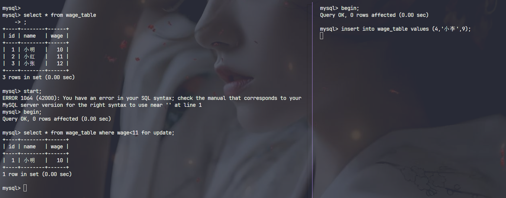

# **MySQL中的事务隔离问题**

## **MVCC**

**简单介绍**

MVCC(Mutiple Version Concurency control 多版本控制), 是MySQL处理高并发事务处理的机制, 通过MVCC, Innodb可以在高并发的环境下, 支持事务隔离，并且提供非阻塞的操作，这样可以避免锁锁定造成的性能瓶颈。

### **核心思想**

MVCC的核心思想是通过保存数据的多个版本实现并发的读写, 每个事务读取的时候看到的是某个数据的特定版本, 而不一定是最新的值，这个机制已改与Undo Log

- 读写分离 : Mycc可以实现读取数据不阻塞写操作, 写也不阻塞读操作, 读写分离, 优化了性能。

- 时间戳版本管理: 每个事务都有唯一的**事务ID tr_id**, Innodb通过事务ID区别数据的不同版本。

- UndoLog : 可以理解为每个表都多了两个列，一个是`trx_id`, 一个值`roll_pointer`, `trx_id`表示事务id, `roll_pointer`作为链表指针指向上一个版本的事务信息的起始位置。

### **MVCC的读写操作的两种类型**

- 快照读 : 不加锁，针对事务的版本进行读取

- 当前读 : 加锁, 读取最新的版本, 为了保证数据的一致性和事务的隔离性, 所以要加锁。

### **数据的修改和版本管理**

数据发生了修改，针对UndoLog进行头插, 但是依然可以根据`trx_id`找到当前事务对应的数据

### **MVCC和事务隔离级别的关系**

- read committed : 读取已经提交, 几乎没有任何的隔离, 默认读取最新的数据信息

- repeatable read : 可重复读, 事务读取的事务开始版本的快照, 即便其他事务进行的数据的修改, 事务通过当前的版本依然能够保证事务的隔离性

## **MySQL中事务隔离中的问题**

**对于Innodb来说, 简单来说可以将事务隔离中的问题分为三种**

- 脏读 : 其他事务读取到另一个事务中未提交的数据, 只会发生在`read committed`中

- 不可重复读 : 前后读取的数据不一致, 侧重于数据的信息不一致，而非数据行数的不同，类似于你的数据在另一个事务中被修改，当时直接映射到你这个事务中。

- 幻读 : 也是前后数据的不一致，侧重于插入和删除，某一行或者多行在另一个事务中被删除或者新添加一个或者多个行

针对这些情况，等级越高的隔离级别，能够从上到下的解决上面的问题。

|隔离级别|脏读|不可重复读|幻读|
|-------|----|----|----|
|read uncommitted|是|是|是|
|read committed||是|是|
|repeatable reads|||是|
|serializable||||

### **Innodb中`repeatable read`是否完全解决了幻读的问题**

答案是否定的，`repeatable read`解决了脏读和不可重复读这是很显然的, 但是针对幻读，应该说，他解决了大部分幻读的问题

**这里给出一个幻读的例子**

|id|name|wage|
|---|---|---|
|1|小明|10|
|2|小红|11|
|3|小张|13|

```sql
事务一：
start transaction;
# 第一次查询
select * from wage_table where wage<11;
# 第二次查询
select * from wage_table where wage<11;
commit;
```

```sql
事务二: 发生在事务一的两次查询之间
start transaction;
insert into wage_table values (1, 小李, 9);
commit;
```

这种情况下, 两次查询的结果不一致, 给用户一种致幻的感觉, 就是幻读。


**Innodb中repeatble read解决隔离性的机制**:


`repeatable read`并没有完全解决幻读的问题, 首先MySQL得读取分为了`当前读`和`快照读`, 快照读通过MVCC保证了事务的隔离性, 前面已经提到了, 我们通过无锁访问`trx_id`保证隔离性,而对于当前读MySQL使用`next-key`解决当前读的幻读问题

`next-key`分为记录锁和间隙锁：

- 记录锁直接锁索引

- 间隙锁可以将索引间的间隙进行锁定

    比如将(2, 4)之间进行锁定的时候, 3不能进行插入

这种机制也的确解决了只有当前读的问题,参考下面实例。



左侧访问当前数据的时候加上了间隙锁, 右侧的申请锁和间隙锁互斥, 不能正常的插入, 等待左侧事务结束。

**那么为什么我们说rr没有完全解决幻读呢？**

从上面我们可以看出,rr解决了当前读和快照读, 但是没有解决他们的结合。
比如: 我们第一次快照读, 另一个事务进行插入, 由于快照读无锁，他可以插入, 我们这个时候进行当前读, 就可能读到右侧插入的数据, 包括我们事务进行插入，删除的时候，本质也是在进行当前读(因为要获得当前的信息), 所以, 这个时候, 问题就出现了。

## 总结

MySQL通过`MVCC`解决快照隔离, `next-key`解决当前读隔离, 针对幻读没有解决的问题, 我认为这不是数据库的bug, 而是用户自己使用时候的不合理行为, 所以, 数据库设计在巧妙, 也是为了简化我们上层开发的设计。
