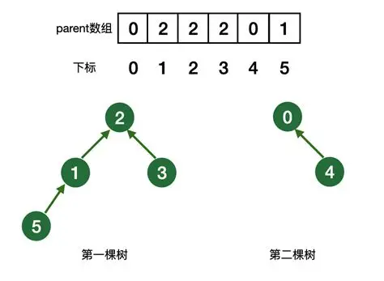
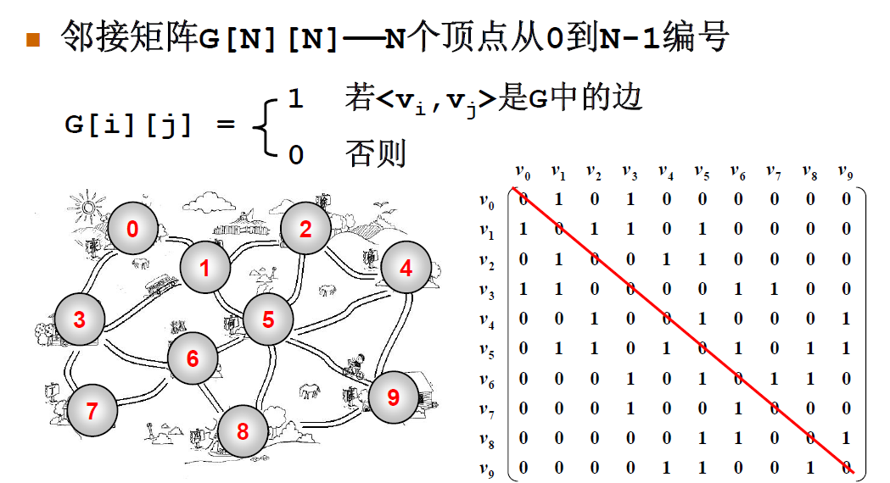
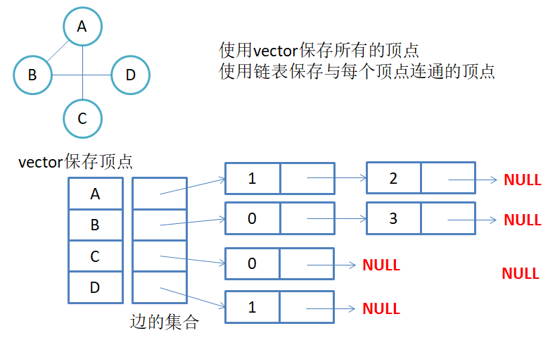
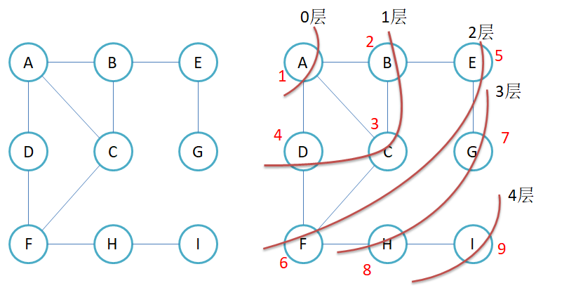
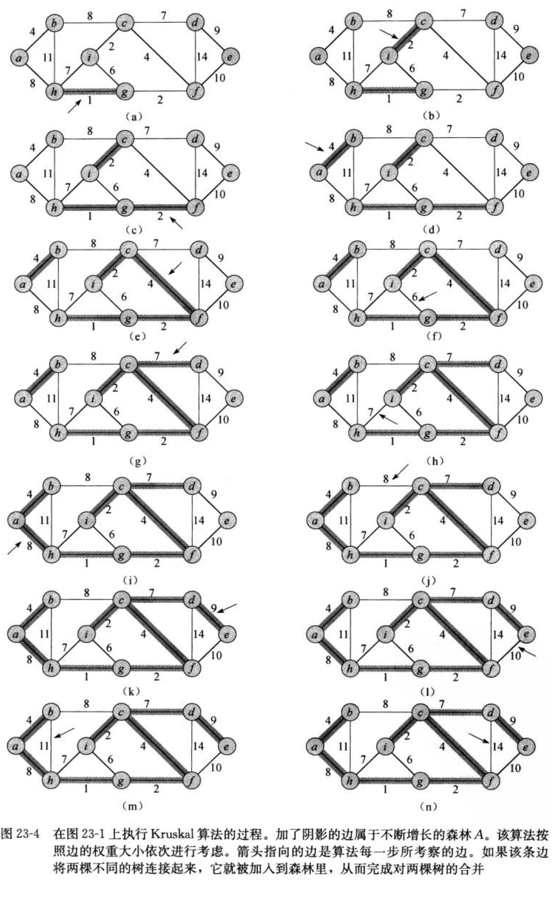
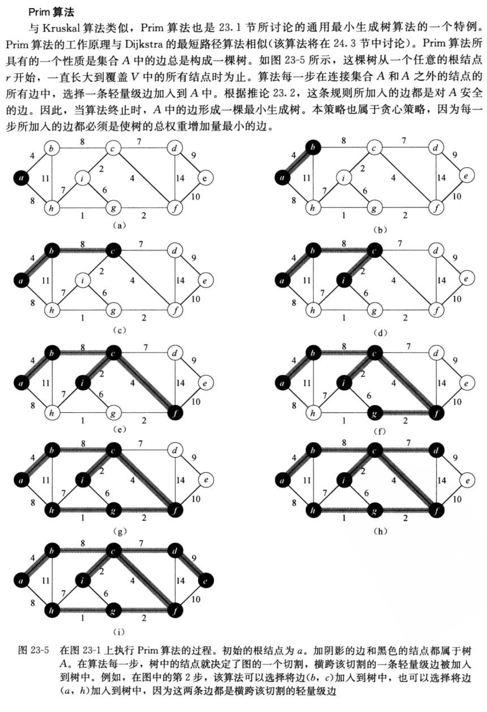

# 高阶数据结构 -- 图(万字总结, 最全面)

## 并查集(后续我们使用判断图成环需要使用)



> 并查集的本质就是森林，森林就是很多的树。

那么我们如果基于数组实现并查集呢? 并查集的本质就是一系列的集合，我们可以通过`双亲表示法来进行统计`, 比如一个集合里面的根，我们就存储`-i`,i表示这个集合的个数, 如果不是根，就存储所在的集合的下标。

==**特点**==:

- 如果辅助数组的位置的值 < 0, 代表是根, 如果 > 0， 这个值就是根的下标。


### 如何进行集合的合并

比如两个人认识了，我们期望进行朋友圈的合并。

1. 首先找到两个人的根。

2. 然后进行根的合并，比如一个根的下标 + 到另一个根，然后这个跟的值变成另一个根的下标。

### 并查集的简单cpp代码

```cpp
#include <iostream>
#include <vector>

// 没有路径压缩的简单的并查集
// 通过这个题目我们可以解决朋友圈的问题

class UnionFindSet
{
public:

    UnionFindSet(size_t n) : _ufs(n, -1)
    {}

    // 合并两个并查集
    void Union(int x1, int x2)
    {
        // 找到两个数的根
        int root_x1 = findRoot(x1);
        int root_x2 = findRoot(x2);
        // 合并两个根
        if(root_x1 != root_x2)
        {
            _ufs[root_x1] += _ufs[root_x2];
            _ufs[root_x2] = root_x1;
        }        
        
    }
    // 获取根
    int findRoot(int x) const
    {
        auto tmp = x;
        while(_ufs[tmp] >= 0) tmp = _ufs[tmp];

        return tmp; 
    }
    // 是否在一个集合里面
    bool isInOneSet(int x1, int x2)
    {
        return findRoot(x1) == findRoot(x2);
    }

    size_t setSize(int x) const 
    {
        size_t count = 0;
        for(auto val : _ufs)
            if(val < 0) count++;
        return count;
    }
private:

    std::vector<int> _ufs;
};
```

### **leetcode并查集练习题目**

#### **990. 等式方程的可满足性**

给定一个由表示变量之间关系的字符串方程组成的数组，每个字符串方程 equations[i] 的长度为 4，并采用两种不同的形式之一："a==b" 或 "a!=b"。在这里，a 和 b 是小写字母（不一定不同），表示单字母变量名。

只有当可以将整数分配给变量名，以便满足所有给定的方程时才返回 true，否则返回 false。 

 

示例 1：

输入：["a==b","b!=a"]
输出：false
解释：如果我们指定，a = 1 且 b = 1，那么可以满足第一个方程，但无法满足第二个方程。没有办法分配变量同时满足这两个方程。
示例 2：

输入：["b==a","a==b"]
输出：true
解释：我们可以指定 a = 1 且 b = 1 以满足满足这两个方程。
示例 3：

输入：["a==b","b==c","a==c"]
输出：true
示例 4：

输入：["a==b","b!=c","c==a"]
输出：false
示例 5：

输入：["c==c","b==d","x!=z"]
输出：true

```cpp
class Solution {
public:
    
    bool equationsPossible(vector<string>& equations) {
        // 切割字符串
        vector<int> ufs(26, -1);

        auto findRoot = [&ufs](int x)
        {
            while(ufs[x] >= 0) x = ufs[x];
            return x;
        };
        auto cutting = [](const std::string& equation, char& val1, char& val2) -> bool
        {
            val1 = equation[0];
            val2 = equation[3];
            return equation[1] == '=';
        };
        for(auto& equation : equations)
        {
            char val1, val2;
            bool equal = cutting(equation, val1, val2);
            if(equal)
            {
                int root1 = findRoot(val1 - 'a');
                int root2 = findRoot(val2 - 'a');
                if(root1 != root2)
                {
                    ufs[root1] += ufs[root2];
                    ufs[root2] = root1;
                }
            }
        }
        for(auto& equation : equations)
        {
            char val1, val2;
            bool equal = cutting(equation, val1, val2);
            if(!equal)
            {
                int root1 = findRoot(val1 - 'a');
                int root2 = findRoot(val2 - 'a');
                if(root1 == root2)
                    return false;
            }
        }
        return true;
    }
};
```

#### **LCR 116. 省份数量**

有 n 个城市，其中一些彼此相连，另一些没有相连。如果城市 a 与城市 b 直接相连，且城市 b 与城市 c 直接相连，那么城市 a 与城市 c 间接相连。

省份 是一组直接或间接相连的城市，组内不含其他没有相连的城市。

给你一个 n x n 的矩阵 isConnected ，其中 isConnected[i][j] = 1 表示第 i 个城市和第 j 个城市直接相连，而 isConnected[i][j] = 0 表示二者不直接相连。

返回矩阵中 省份 的数量。

```cpp

class UnionFindSet
{
public:

    UnionFindSet(size_t n) : _ufs(n, -1)
    {}

    // 合并两个并查集
    void Union(int x1, int x2)
    {
        // 找到两个数的根
        int root_x1 = findRoot(x1);
        int root_x2 = findRoot(x2);
        // 合并两个根
        if(root_x1 != root_x2)
        {
            _ufs[root_x1] += _ufs[root_x2];
            _ufs[root_x2] = root_x1;
        }  
    }
    // 获取根
    int findRoot(int x) const
    {
        auto tmp = x;
        while(_ufs[tmp] >= 0) tmp = _ufs[tmp];

        return tmp; 
    }
    // 是否在一个集合里面
    bool isInOneSet(int x1, int x2)
    {
        return findRoot(x1) == findRoot(x2);
    }

    size_t setSize() const 
    {
        size_t count = 0;
        for(auto val : _ufs)
            if(val < 0) count++;
        return count;
    }
private:

    std::vector<int> _ufs;
};
class Solution {
public:
    int findCircleNum(vector<vector<int>>& isConnected) {
        UnionFindSet ufs(isConnected.size());
        for(int i = 0;i < isConnected.size();i++)
        {
            for(int j = 0;j < isConnected[i].size();j++)
                if(isConnected[i][j])
                    ufs.Union(i, j);
        }
        return ufs.setSize();
    }

};
```

## **图**

### **简介**

通过边，节点构成的数据结构，我们称作图，树是一种特殊的图，但是树和图又不太一样，树更多的关注的是树的节点，比如`AVL树， 红黑树`,

但是图更多的是关注的是边的权值以及节点信息。


### **图的表示方式**

#### **领接矩阵**



> 通过矩阵的方式表示一个图, `matrix[i][j]`表示i和j是否相连，并且可以表示i和j的权重。


优点 ： 

1. o(1)的时间复杂度判断两个顶点的连接关系

2. 非常时候稠密图

缺点

1. 不适合稀疏矩阵

2. 不适合判断一个节点的连接的边, 一定o(n)

```cpp
#pragma once
#include <iostream>
#include <vector>
#include <map>

template <class V,class W,W MAX_W = __INT32_MAX__, bool Direction = false> 
class Graph
{
public:
    Graph(const V* array, int n)
    {
        for(int i = 0;i < n;i++)
        {
            _vertexs.push_back(array[i]);
            _indexMap[array[i]] = i;
        }

        _matrix.resize(n);
        for(auto& row : _matrix)
        {
            row.resize(n, MAX_W);
        }

    }   

    void addEdge(const V& src, const V& dst, const W& w)
    {
        // 判断数据是否合理
        if(!_indexMap.count(src) || !_indexMap.count(dst)) 
        {
            throw std::invalid_argument("顶点不存在");
            return;
        }
        auto index1 = _indexMap[src];
        auto index2 = _indexMap[dst];
        // 添加边
        if(!Direction)
        {
            _matrix[index1][index2] = _matrix[index2][index1] = w; 
        }
        else _matrix[index1][index2] = w;
    }

    void printMatrix() const 
    {
        for(auto& row : _matrix)
        {
            for(auto val : row)
                std::cout << val << " ";
            std::cout << std::endl;
        }
    }
private:
    std::vector<V> _vertexs;
    std::map<V,int> _indexMap;
    std::vector<std::vector<W>> _matrix;
};
```

#### **邻接表**

> 通过对节点进行描述, 每个节点中通过数组存储与之相连的一系列节点



他的优缺点和领接矩阵正好相反，形成互补的数据结构, 用什么结构，就看我们的需求。

### **图中一些基本的概念**

- 常见的图

    - 无向完全图 : 任意两个顶点之间存在一条无向边

    - 有向完全图 : 任意两个顶点之间存在两条相反的边

- 入度和出度(对于有向图)

    - 入度 : 被指向的边的个数

    - 出度 ：指向出的边的个数

- 路径 
    
    > 从一个节点能够到另一个节点的边的集合称作路径。 

- 回路 

    > 路径的第一个节点和最后一个节点相同，称作回路

- 简单路径

    > 一个路径里面没有重复的节点

- 连通图    

    > 对于图G<V,G>, 如果v1, v2存在路径, 那么v1 v2连通，如果一个图
    > 中任意两个节点之间连通，就构成连通图, 针对`有向图`, 如果任意两个节点v1, v2,如果同时存在v1 -> v2的路径和v2 -> v1的路径，那么我们就成为强连通。

- 生成树

    > 一个连通图的最小连通子图称作该图的生成树, n个节点的生成树的边的个数为n - 1条边


**说到图的结构，如何通过一个节点，一个一个遍历整个图结构的方法有很多种，就比如`深度优先遍历`和`广度优先遍历`**

### **深度优先遍历**

我们可以利用递归进行深度优先遍历，也可以使用栈，当然递归的本质就是函数栈帧的递归。

```cpp
// * step : 代表所处的层数
    void DFSHelper(int pos, std::vector<bool>& used)
    {
        used[pos] = true;
        std::cout << _vertexs[pos] << std::endl;
        for(decltype(_matrix[pos].size()) j = 0;j < _matrix[pos].size();j++)
        {
            if(_matrix[pos][j] != __INT32_MAX__ && used[j] == false)
                DFSHelper(j, used);
        }
    }
    void DFS(const V& val)
    {
        if(_indexMap.count(val) == false) 
        {
            throw std::invalid_argument("不含有该值");
            return;
        }
        std::vector<bool> used(_vertexs.size(), false);
        DFSHelper(_indexMap[val], used);
    }
```


### **广度优先遍历**



#### **实现方式**:

利用队列，我们每次遍历一个节点的时候，都将它相连的节点假如我们的队列, 

最后就可以实现广度优先遍历，也就是层序遍历。

```cpp
// 利用队列实现层序遍历

void BFS(const V& begin)
    {
        if(_indexMap.count(begin) == false) 
        {
            throw std::invalid_argument("没有该数据");
            return;
        }
        
        int cur = _indexMap[begin];
        std::queue<int> q;
        std::vector<bool> used(_vertexs.size(), false);
        q.push(cur);
        used[cur] = true;
        int step = 0;
        while(q.size())
        {
            int sz = q.size();
            std::cout << "第" << step << "层" << std::endl;
            for(int i = 0;i < sz;i++)
            {
                cur = q.front();
                q.pop();
                std::cout << _vertexs[cur] << std::endl;
                for(int j = 0;j < _matrix[cur].size();j++)
                {
                    if(_matrix[cur][j] != __INT32_MAX__ && !used[j])
                    {
                        q.push(j);
                        used[j] = true;
                    }
                }
            }
            ++step;
        }

    }
```

### **最小生成树**

> 一个连通图通过删除边得到的满足连通的最小的子图称作最小生成树。

两种算法: 

1. `kruskal`算法, 贪心算法

    
    
    任给一个有n个顶点的连通网络N={V,E} :

    - 首先构造一个由这n个顶点组成、不含任何边的图G={V,NULL}，其中每个顶点自成一个连通分量，
    - 其次不断从E中取出权值最小的一条边(若有多条任取其一)，若该边的两个顶点来自不同的连通分量(**其实就是不能构成环**)，则将此边加入到G中。如此重复，直到所有顶点在同一个连通分量上为止。
    - 核心：每次迭代时，选出一条具有最小权值，且两端点不在同一连通分量上的边，加入生成树。

    ```cpp
    // 通过KrusKal算法构建最小生成树
    W KrusKal(Self& tree)
    {
        std::priority_queue<Edge,std::vector<Edge>,std::greater<Edge>> pq;
        // 
        int n = _vertexs.size();
        for(int i = 0;i < n;i++)
        { 
            for(int j = 0;j < n;j++)
            {
                if(i < j && _matrix[i][j] != MAX_W)
                    pq.push({i, j, _matrix[i][j]});
            }
        }
        UnionFindSet ufs(n);
        // 通过KrusKal算法选出n - 1条边
        int size = 0;
        W totalW = W();
        while(pq.size())
        {
            Edge min = pq.top();
            pq.pop();
            
            if(!ufs.isInOneSet(min._src,min._dst))
            {
                tree.addEdgeByPos(min._src,min._dst,min._wage);
                ufs.Union(min._src,min._dst);
                ++size;
                totalW += min._wage;
            }
        }
        // 判断是否构成最小生成树
        if(size == n - 1)
        {
            return totalW;
        }
        else 
        {
            return W();
        }
        return W();
    
    ```

2. `Prime`算法

    
    
    ```cpp
    // Prim算法
    W Prime(Self& tree,const V& begin)
    {   
        if(_indexMap.count(begin) == false)
        {
            throw std::invalid_argument("错误的输入");
            return W();
        }

        auto index = _indexMap[begin];
        tree._vertexs = _vertexs;
        tree._indexMap = _indexMap;
        tree._matrix = _matrix;
        size_t n = _vertexs.size();
        for(size_t i = 0;i < n;i++)
            tree._matrix[i].resize(n, MAX_W);
        // prime算法的本质将原来的看做两块
        std::set<int> X_set;
        std::set<int> Y_set; 
        X_set.insert(index);
        for(size_t i = 0;i < n;i++)
            if(i != index) Y_set.insert(i);
        //
        std::priority_queue<Edge,std::vector<Edge>,std::greater<Edge>> minque;
        for(size_t i = 0;i < n;i++)
            if(_matrix[index][i] != MAX_W)
                minque.push(Edge(index,i,_matrix[index][i]));
        
        size_t count = 0;
        W res = W();
        while(!minque.empty())
        {
            Edge edge = minque.top();
            minque.pop();
            // 这里应该处理一下判定环
            if(X_set.count(edge._dst))
            {
                std::cout << "构成环" << std::endl;
                std::cout << _vertexs[edge._src]<< " -> " << _vertexs[edge._dst] << " wage:" << edge._wage << std::endl; 
            }

            else 
            {
                tree.addEdgeByPos(edge._src,edge._dst,edge._wage);
                X_set.insert(edge._dst);
                Y_set.erase(edge._dst);

                count++;
                res += edge._wage;
                std::cout << _vertexs[edge._src]<< " -> " << _vertexs[edge._dst] << " wage:" << edge._wage << std::endl; 
                
                if(count == n - 1) break;

                for(size_t i = 0;i < n;i++)
                    if(_matrix[edge._dst][i] != MAX_W && !X_set.count(i))
                        minque.push(Edge(edge._dst,i,_matrix[edge._dst][i]));
            }
                
        }

        if(count == n - 1) return res;
        else return W();
    }
    ```
    
#### **如何判断是否构成环**

`并查集`可以帮助我们判断是否构成环, 最开始每个节点构成一个集合, 当我们边相连后, 这两个节点就会进行集合的合并。

`缓存去重`: 通过hashTable或者通过红黑树进行去重的操作。


