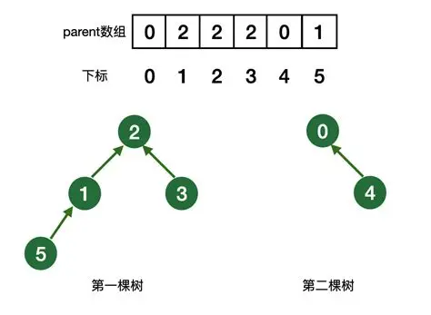

# 高阶数据结构 -- 图

## 并查集(朋友圈)



> 并查集的本质就是森林，森林就是很多的树。

那么我们如果基于数组实现并查集呢? 并查集的本质就是一系列的集合，我们可以通过`双亲表示法来进行统计`, 比如一个集合里面的根，我们就存储`-i`,i表示这个集合的个数, 如果不是根，就存储所在的集合的下标。

==**特点**==:

- 如果辅助数组的位置的值 < 0, 代表是根, 如果 > 0， 这个值就是根的下标。


### 如何进行集合的合并

比如两个人认识了，我们期望进行朋友圈的合并。

1. 首先找到两个人的根。

2. 然后进行根的合并，比如一个根的下标 + 到另一个根，然后这个跟的值变成另一个根的下标。

### 并查集的简单cpp代码

```cpp
#include <iostream>
#include <vector>

// 没有路径压缩的简单的并查集
// 通过这个题目我们可以解决朋友圈的问题

class UnionFindSet
{
public:

    UnionFindSet(size_t n) : _ufs(n, -1)
    {}

    // 合并两个并查集
    void Union(int x1, int x2)
    {
        // 找到两个数的根
        int root_x1 = findRoot(x1);
        int root_x2 = findRoot(x2);
        // 合并两个根
        if(root_x1 != root_x2)
        {
            _ufs[root_x1] += _ufs[root_x2];
            _ufs[root_x2] = root_x1;
        }        
        
    }
    // 获取根
    int findRoot(int x) const
    {
        auto tmp = x;
        while(_ufs[tmp] >= 0) tmp = _ufs[tmp];

        return tmp; 
    }
    // 是否在一个集合里面
    bool isInOneSet(int x1, int x2)
    {
        return findRoot(x1) == findRoot(x2);
    }

    size_t setSize(int x) const 
    {
        size_t count = 0;
        for(auto val : _ufs)
            if(val < 0) count++;
        return count;
    }
private:

    std::vector<int> _ufs;
};
```

### **leetcode并查集练习题目**

#### **990. 等式方程的可满足性**

给定一个由表示变量之间关系的字符串方程组成的数组，每个字符串方程 equations[i] 的长度为 4，并采用两种不同的形式之一："a==b" 或 "a!=b"。在这里，a 和 b 是小写字母（不一定不同），表示单字母变量名。

只有当可以将整数分配给变量名，以便满足所有给定的方程时才返回 true，否则返回 false。 

 

示例 1：

输入：["a==b","b!=a"]
输出：false
解释：如果我们指定，a = 1 且 b = 1，那么可以满足第一个方程，但无法满足第二个方程。没有办法分配变量同时满足这两个方程。
示例 2：

输入：["b==a","a==b"]
输出：true
解释：我们可以指定 a = 1 且 b = 1 以满足满足这两个方程。
示例 3：

输入：["a==b","b==c","a==c"]
输出：true
示例 4：

输入：["a==b","b!=c","c==a"]
输出：false
示例 5：

输入：["c==c","b==d","x!=z"]
输出：true

```cpp
class Solution {
public:
    
    bool equationsPossible(vector<string>& equations) {
        // 切割字符串
        vector<int> ufs(26, -1);

        auto findRoot = [&ufs](int x)
        {
            while(ufs[x] >= 0) x = ufs[x];
            return x;
        };
        auto cutting = [](const std::string& equation, char& val1, char& val2) -> bool
        {
            val1 = equation[0];
            val2 = equation[3];
            return equation[1] == '=';
        };
        for(auto& equation : equations)
        {
            char val1, val2;
            bool equal = cutting(equation, val1, val2);
            if(equal)
            {
                int root1 = findRoot(val1 - 'a');
                int root2 = findRoot(val2 - 'a');
                if(root1 != root2)
                {
                    ufs[root1] += ufs[root2];
                    ufs[root2] = root1;
                }
            }
        }
        for(auto& equation : equations)
        {
            char val1, val2;
            bool equal = cutting(equation, val1, val2);
            if(!equal)
            {
                int root1 = findRoot(val1 - 'a');
                int root2 = findRoot(val2 - 'a');
                if(root1 == root2)
                    return false;
            }
        }
        return true;
    }
};
```

#### **LCR 116. 省份数量**

有 n 个城市，其中一些彼此相连，另一些没有相连。如果城市 a 与城市 b 直接相连，且城市 b 与城市 c 直接相连，那么城市 a 与城市 c 间接相连。

省份 是一组直接或间接相连的城市，组内不含其他没有相连的城市。

给你一个 n x n 的矩阵 isConnected ，其中 isConnected[i][j] = 1 表示第 i 个城市和第 j 个城市直接相连，而 isConnected[i][j] = 0 表示二者不直接相连。

返回矩阵中 省份 的数量。

```cpp

class UnionFindSet
{
public:

    UnionFindSet(size_t n) : _ufs(n, -1)
    {}

    // 合并两个并查集
    void Union(int x1, int x2)
    {
        // 找到两个数的根
        int root_x1 = findRoot(x1);
        int root_x2 = findRoot(x2);
        // 合并两个根
        if(root_x1 != root_x2)
        {
            _ufs[root_x1] += _ufs[root_x2];
            _ufs[root_x2] = root_x1;
        }  
    }
    // 获取根
    int findRoot(int x) const
    {
        auto tmp = x;
        while(_ufs[tmp] >= 0) tmp = _ufs[tmp];

        return tmp; 
    }
    // 是否在一个集合里面
    bool isInOneSet(int x1, int x2)
    {
        return findRoot(x1) == findRoot(x2);
    }

    size_t setSize() const 
    {
        size_t count = 0;
        for(auto val : _ufs)
            if(val < 0) count++;
        return count;
    }
private:

    std::vector<int> _ufs;
};
class Solution {
public:
    int findCircleNum(vector<vector<int>>& isConnected) {
        UnionFindSet ufs(isConnected.size());
        for(int i = 0;i < isConnected.size();i++)
        {
            for(int j = 0;j < isConnected[i].size();j++)
                if(isConnected[i][j])
                    ufs.Union(i, j);
        }
        return ufs.setSize();
    }

};
```

## **图**

### **简介**

通过边，节点构成的数据结构，我们称作图，树是一种特殊的图，但是树和图又不太一样，树更多的关注的是树的节点，比如`AVL树， 红黑树`,

但是图更多的是关注的是边的权值以及节点信息。

